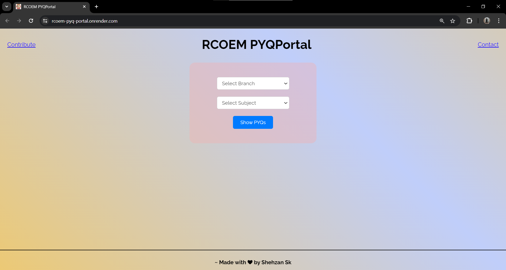

# RCOEM PYQ Portal

## Introduction
This project aims to simplify the process of downloading semester Past Year Questions (PYQ) for students of RCOEM (Shri Ramdeobaba College of Engineering and Management). 

## Motivation
Many students face challenges in finding and downloading past year questions for their semesters. This project addresses the common issues faced by students:
- Difficulty in locating the past year questions for different subjects and semesters.
- Time-consuming process of manually navigating through folders to download PYQs for each subject and year.

## Solution
This web application provides a user-friendly interface to download semester-wise past year questions in just one click. The process is straightforward:
1. Select the degree.
2. Select the branch.
3. Pick the subject.
4. Click to download.

## How to Use
To use this application, follow these simple steps:
1. Open the website.
2. Choose your branch from the provided options.
3. Select the semester you're interested in.
4. Pick the subject for which you want to download past year questions.
5. Click the download button to obtain all the available past year questions for the selected subject and semester.

## Benefits
Using this application can save students valuable time by eliminating the need to manually search and download past year questions. It streamlines the process, allowing students to focus more on their studies rather than spending time on administrative tasks.

## Website
You can access the website [here](https://rcoem-pyq-portal.onrender.com/).

## Screenshots

## Contribution
If you find any issues or have suggestions for improvements, feel free to contribute to the project by submitting a pull request or opening an issue on GitHub.

## Disclaimer
This project is intended for educational purposes only. All rights to the PYQs belong to RCOEM(Shri Ramdeobaba College of Engineering and Management).
